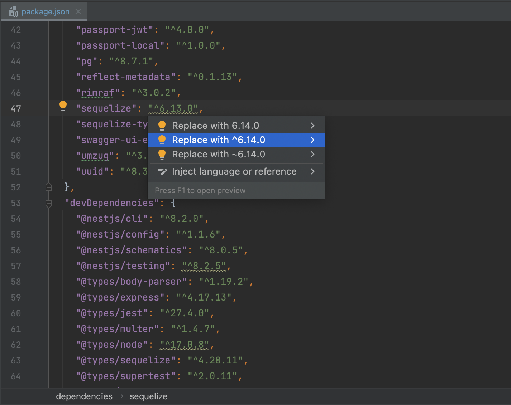

# npm-dependency-checker

<!-- Plugin description -->
This IntelliJ plugin inspects your package.json file to find if you're using the latest package versions from the [registry.npmjs.org](https://registry.npmjs.org) - the official package repository.

Inspired by [Flutter Pub Version Checker](https://github.com/pszklarska/FlutterPubVersionChecker), I decided to write something similar for the package. But I don’t know Kotlin at all, because it turned out what happened). I will be glad to feedback and help

## How to use?

Once plugin is installed, go to the package.json file. If plugin finds that newer version is available, you'll see it highlighted.
To fix that, press Cmd+Enter (Alt+Enter) or click the action indicator to the left of the caret to open the action list and choose "Replace with".
<!-- Plugin description end -->

## What's new?

See [CHANGELOG](CHANGELOG.md) to see what's new.

## How can I help?

Feel free to send [Pull Request](https://github.com/unger1984/npm-dependency-checker/pulls) or file a new [Issue](https://github.com/unger1984/npm-dependency-checker/issues)! Or...
